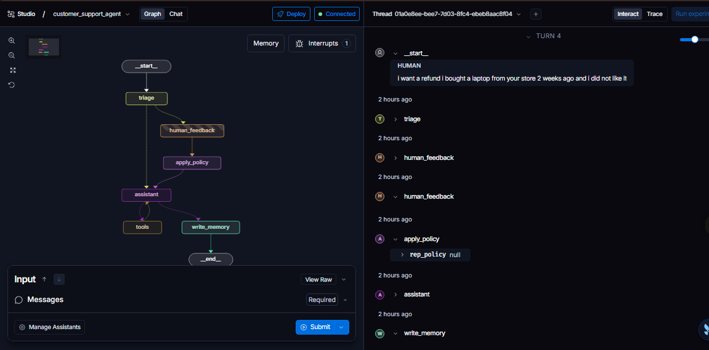
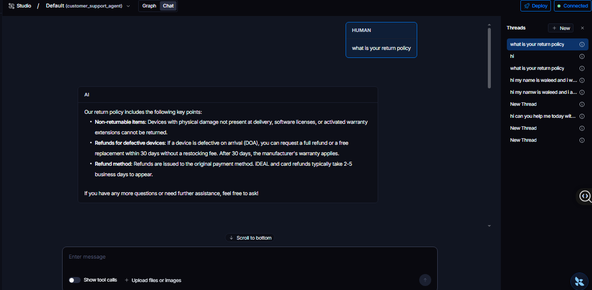
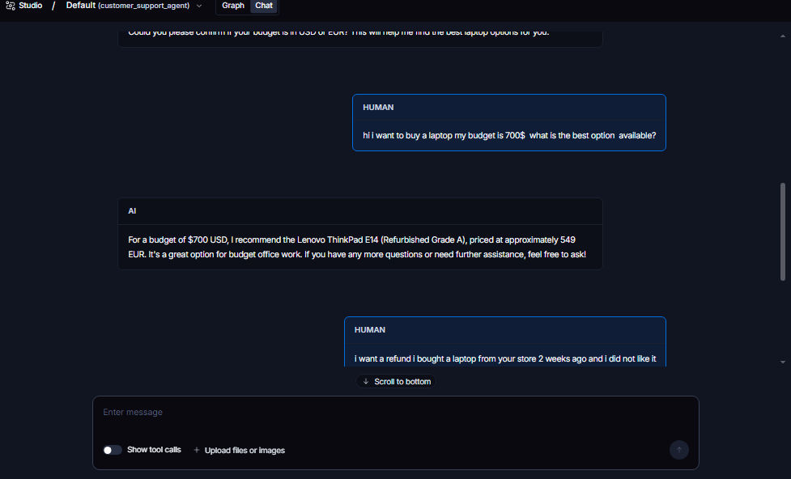
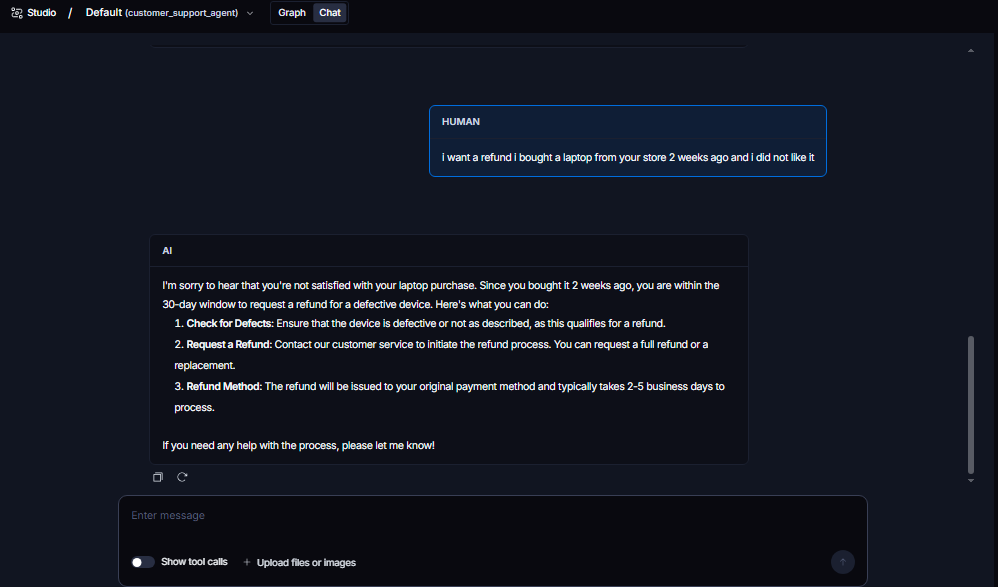

# Customer Support Agent

A LangGraph-based customer support chatbot for a fictional Dutch electronics retailer (laptops and phones). It answers routine questions from real company documents, recommends products through a short clarifying conversation, and escalates refund requests or angry customers to a human rep for approval before continuing.

## Overview

TechNL sells laptops and phones in the Netherlands. This agent handles first-line support:

- Answers questions about shipping, returns, warranty, and payment using retrieval over TechNL's actual policy documents (RAG), not the model's general knowledge.
- Recommends a laptop or phone, asking about budget or use case first instead of guessing.
- Detects refund requests and negative sentiment, and pauses for a human rep before responding.
- Remembers each customer across separate conversations (name, preferences, past escalations).
- Lets reps set standing rules ("do not escalate shipping delays under 3 days") that apply to every future customer, without a code change.

## Features

- **RAG-grounded answers** over a Chroma vector store built from the FAQ, shipping, and return policy documents.
- **Product recommendations** against a small structured catalog, with a clarifying question when the customer has not given a budget or use case.
- **Human-in-the-loop escalation**: refund requests always pause for a human; negative sentiment pauses unless a standing policy says otherwise.
- **Long-term customer memory**: a profile (name, notes, preferences, escalation count) persists across threads for the same customer.
- **Rep-editable standing policy**: a global, free-text rule set that reps can grow over time, injected into every future decision.
- **Runs in LangGraph Studio**, with the graph, interrupts, and state fully visible and editable.

## Architecture

    Customer message
           |
       Triage (refund? angry?)
           |
       +---+----+
      NO        YES
       |         |
       |     [PAUSED] human_feedback
       |     rep: approve / rewrite reply / policy:<rule>
       |         |
       |     apply_policy (saves rule to the Store)
       +----+----+
            |
        Assistant (uses docs, catalog, customer profile, standing policy)
            |
       Tool call? --- YES --> tools --> back to Assistant
            | NO
            |
       write_memory (updates the customer profile)
            |
           END

Two Store namespaces hold long-term memory: one per customer for their profile, one global for the rep-set policy. A checkpointer holds the short-term, per-thread conversation.

## Built with LangGraph

This project uses:

- **StateGraph** with a custom state (`SupportState`) extending `MessagesState`.
- **Conditional edges** to route between auto-answer and escalation, and between tool calls and a plain reply.
- **`interrupt_before`** to pause the graph before the `human_feedback` node, so a human can approve or rewrite the response before the conversation continues.
- **`ToolNode`** for the retrieval and product-lookup tools, following the standard LangGraph ReAct pattern.
- **A checkpointer** (`MemorySaver` locally, or the LangGraph Platform's built-in one in Studio) for short-term, per-thread memory.
- **A `Store`** (`InMemoryStore` locally, or the platform's store in Studio) for long-term memory that persists across threads: customer profiles and the shared rep policy.
- **Structured output** (`with_structured_output`) for the triage decision and the sentiment-escalation check, so those decisions are reliable typed fields instead of free text the code has to parse.

## Other libraries used

| Library | Purpose |
|---|---|
| `langchain-openai` | Chat model and embeddings (GPT-4o, text-embedding-3-small) |
| `langchain-chroma` | Vector store for the policy document search |
| `langchain-community` | Document loader for the markdown knowledge base |
| `pydantic` | Schemas for triage results, the customer profile, and structured tool output |
| `python-dotenv` | Loads the OpenAI API key from `.env` |
| `langgraph-cli[inmem]` | Runs the local dev server for LangGraph Studio |

## Project structure

    customer_support_agent/
    |-- knowledge_base/
    |   |-- faq.md                General payment, warranty, tracking questions
    |   |-- shipping_policy.md     Shipping costs, timing, and areas covered
    |   |-- return_policy.md       Return window, DOA refunds, refund method
    |   |-- products.json          Structured laptop/phone catalog
    |-- state.py                   Shared graph state (SupportState)
    |-- graph.py                   The graph itself: nodes, edges, compilation
    |-- tools.py                   search_policies and find_products tools
    |-- prompts.py                 The assistant's system prompt
    |-- memory_schema.py           CustomerProfile schema
    |-- memory_store.py            Read/write the per-customer profile in the Store
    |-- policy_store.py            Read/write the shared rep policy in the Store
    |-- products.py                Plain Python filter over products.json
    |-- ingest.py                  One-time script: builds the Chroma vector store
    |-- chat.py                    Terminal chat loop, with escalation handling
    |-- test_policy.py             Automated check of the escalation + policy logic
    |-- langgraph.json             Studio/CLI configuration
    |-- requirements.txt
    |-- .env                       API keys (not committed)

## Screenshots

**The graph in Studio, mid-escalation** (interrupt badge visible, `human_feedback` -> `apply_policy` path taken):

**A normal, document-grounded answer:**

**The recommendation flow asking for a budget first:**

**A refund request being handled:**

## Setup

    git clone https://github.com/waleedsaeedma/customer-support-agent.git
    cd customer-support-agent
    python -m venv .venv
    .venv\Scripts\Activate.ps1        # Windows
    # source .venv/bin/activate       # macOS/Linux
    pip install -r requirements.txt

## Configuration

Create a `.env` file in the project root:

    OPENAI_API_KEY=your_key_here

    # Optional, only needed for LangSmith tracing
    LANGSMITH_API_KEY=your_key_here
    LANGSMITH_TRACING=true
    LANGSMITH_PROJECT=customer_support_agent

## Usage

**1. Build the vector store** (only needs to be run once, or again if you edit the knowledge base):

    python ingest.py

**2. Chat in the terminal:**

    python chat.py

**3. Run in LangGraph Studio:**

    langgraph dev

Then open the Studio URL it prints. Use Graph mode to pass a `customer_id`, or Chat mode, which falls back to a shared `guest` profile.

## Example interactions

**Policy question:**
> **You:** What is your return policy?
> **Bot:** Refunds are issued to the original payment method... [grounded in return_policy.md]

**Product recommendation:**
> **You:** I want to buy a laptop, my budget is 700 EUR.
> **Bot:** I recommend the Lenovo ThinkPad E14 (Refurbished Grade A), 549 EUR...

**Escalation:**
> **You:** I want a refund, I bought this laptop 2 weeks ago and I don't like it.
> **[Graph pauses. A human rep reviews the case before the customer gets a reply.]**

**Setting a standing policy (as a rep, during an escalation):**
> **Rep:** policy: do not escalate shipping delays under 3 days
> *(This rule now applies to every future customer, automatically.)*

## Known limitations

- **No persistence yet**: customer profiles and the rep policy live in memory and are lost when the server restarts. Swapping `InMemoryStore`/`MemorySaver` for a database-backed store is the natural next step.
- **English-only knowledge base**, despite the target market being the Netherlands.
- **No real order lookups**: the bot cannot check an actual order status or issue a real refund; escalation stops at human review.
- **`rep_policy` is part of the graph's public input schema**, so it should be split into a separate input/output schema before this is exposed to real customers.
- **Test coverage is a handful of manual/scripted cases**, not a full evaluation set.

## License

MIT
